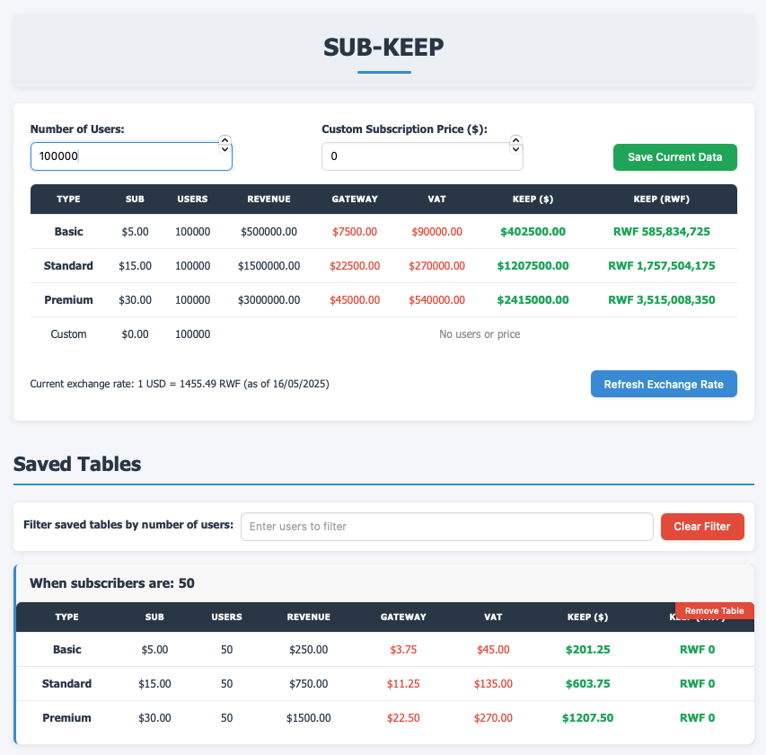
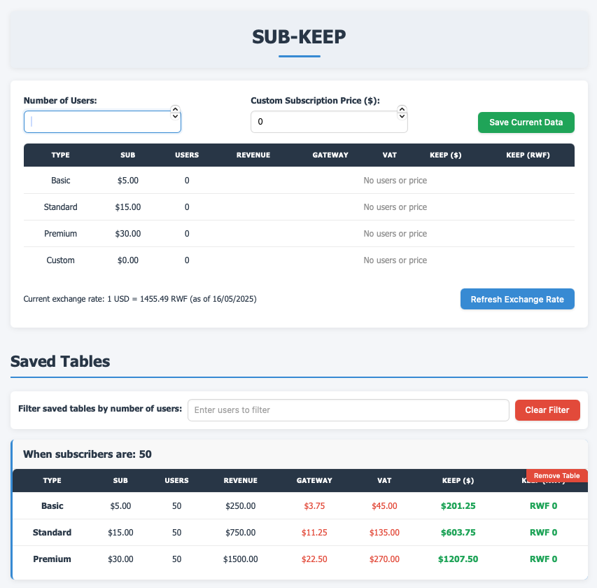

# SUB-KEEP
**Subscription Revenue & Fees Calculator**

SUB-KEEP is a web-based application that helps businesses calculate their actual revenue after fees and taxes for subscription-based services. It features real-time currency conversion to Rwandan Francs (RWF) and allows saving calculations for future reference.

---

 

## ✨ Features

- **Multiple Subscription Tiers**: Pre-configured Basic ($5), Standard ($15), and Premium ($30) plans, plus a custom pricing option
- **Revenue Calculation**: Instantly calculate total revenue based on the number of users
- **Fee Breakdown**: 
  - Flutterwave payment gateway fee (1.5%)
  - VAT (18%)
  - Net revenue in USD
- **Currency Conversion**: Real-time USD to RWF conversion using exchange rate API
- **Save & Compare**: Store calculations to compare different scenarios
- **Filtering**: Filter saved tables by the number of users
- **Responsive Design**: Mobile-friendly interface that works on all devices
- **Local Storage**: All data stored locally in your browser

---

## 🚀 Installation

SUB-KEEP is a client-side application that runs directly in your browser. No server-side installation is required.

### Option 1: Run Locally
```bash
git clone https://github.com/ruberwa/sub-keep.git
cd sub-keep
```

### Option 2: Hosted Version
Simply visit: [https://ruberwa.github.io/sub-keep](https://ruberwa.github.io/sub-keep) 

---

## 💻 How to Use

1. **Enter User Count**: Input the number of subscribers
2. **Set Custom Price** (Optional): Enter a custom subscription price if needed
3. **View Calculations**: The table automatically updates with:
   - Revenue for each subscription tier
   - Gateway fees
   - VAT
   - Net revenue in USD and RWF
4. **Save Results**: Click "Save Current Data" to store the current calculation
5. **Filter Saved Tables**: Use the filter to find saved calculations by user count
6. **Update Exchange Rate**: Click "Refresh Exchange Rate" to get the latest USD to RWF conversion rate

### Screenshots

#### Initial View (No Users)


#### With User Data


---

## 🧮 How Calculations Work

### Revenue
```
Total Revenue = Number of Users × Subscription Price
```

### Fees
```
Flutterwave Fee = Total Revenue × 0.015 (1.5%)
VAT = Total Revenue × 0.18 (18%)
Net Revenue (USD) = Total Revenue - Flutterwave Fee - VAT
Net Revenue (RWF) = Net Revenue (USD) × Current Exchange Rate
```

---

## 🌐 Browser Compatibility

SUB-KEEP works on all modern browsers:
- Chrome (recommended)
- Firefox
- Safari
- Edge

---

## 🔧 Technical Details

- **Frontend**: HTML5, CSS3, JavaScript (ES6+)
- **Storage**: Browser's localStorage API
- **External API**: ExchangeRate-API for currency conversion
- **Responsive Design**: CSS media queries for mobile compatibility
- **No Dependencies**: Zero external JavaScript libraries required

---

## 🔒 Data Privacy

All data is stored locally in your browser using localStorage. No data is sent to any server except when fetching the current exchange rate.

---


---

## 👏 Acknowledgments

- Exchange rates provided by [ExchangeRate-API](https://www.exchangerate-api.com/)
- Payment processing fees based on [Flutterwave](https://flutterwave.com/) standard rates

---

